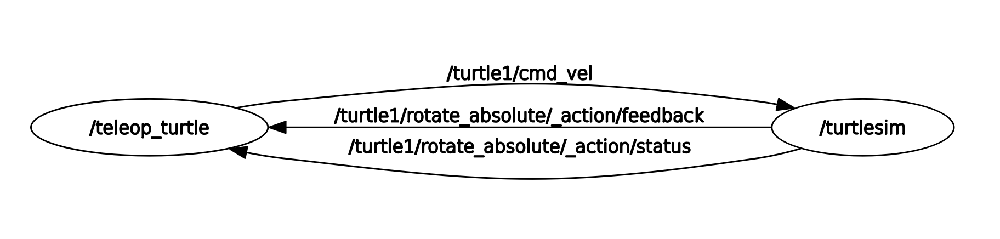
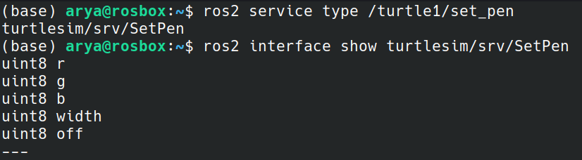

# Assignment1
----
## Exercise1

1. To change a node's name, the `--remap` argument can be used with the following command, which renames the node `turtle1` to `my_turtle01`:
   ```` bash
   ros2 run turtlesim turtlesim_node --ros-args --remap __node:=my_turtle01
   ````
   This command creates a new node named `my_turtle01`. By running `ros2 node list` command, we can observe the newly created node in the list.\
   

2. One way to facilitate message exchange in ROS2 is through topics, employing a subscriber-publisher pattern. In this approach, a node publishes a message of a specific type on a designated topic, while another node subscribes to that topic and receives the messages published there.
For instance, in the context of turtlesim, each turtlenode possesses a `cmd_vel` topic to which it subscribes, enabling it to receive `geometry_msgs/msg/Twist` messages. These Twist messages consist of two components: linear and angular velocities, governing the turtle's motion. By publishing Twist messages on the turtle's "cmd_vel" topic, we gain control over the turtle's movement.

By running the following commands, you can first ascertain the message type of `cmd_vel`, and subsequently, publish the appropriate type of message to the topic. The `--rate` flag controls the publishing rate (Hz) on the topic.
   ```` bash
   ros2 topic info /trutle1/cmd_vel
   ros2 topic pub --rate 2 /turtle1/cmd_vel geometry_msgs/msg/Twist "{linear: {x: 2.0, y: 0.0, z: 0.0}, angular: {x: 0.0, y: 0.0, z: 1.8}}"
   ````
3. Another type of messaging supported by ROS2 is services, following a server-client schema. One such example is the "set_pen" service of turtlenodes. By executing the command 
`ros2 service type /turtle1/set_pen`
you can identify the type of this service, which is `turtlesim/srv/SetPen`.
To obtain detailed information about its structure, running 
`ros2 interface show turtlesim/srv/SetPen`
reveals that it consists of 5 uint8 variables: r, g, b, width, and off.
The variables r, g, and b are responsible for defining the color of the pen, while width determines the width of the pen. To initiate a red pen with a width of 3, use the following command: 
   ```` bash
   ros2 service call /turtle1/set_pen turtlesim/srv/SetPen "{r: 255, g: 0, b: 0, width: 3}"
   ````
   
4. The last messaging schema used in ROS2 is actions, which represent a combination of topics and services. For instance, consider a scenario where a robot needs to travel to a goal position. To obtain the goal position, the robot can use services. During the transit, if the robot wants to send its current position, it can publish its pose on a topic.
By utilizing two services and one topic, it is possible to simulate an action in ROS2 since it essentially combines the functionalities of both topics and services. This approach enables a more complex and interactive communication process between the action client and server. The action is initiated when the client sends a goal request to the server through a service call, specifying the task to be accomplished. As the action progresses, the server publishes feedback messages on a designated topic, keeping the client informed about the ongoing process. Once the action is completed, the server sends the final result back to the client, indicating the end of the request.
5. ROS2 offers five log levels: Fatal, Error, Warn, Info, and Debug. The default log level is Info, which displays the more critical logs (Fatal, Error, and Warn), while hiding the Debug logs containing detailed information about system processes that may not be necessary. By using the Info log level, only the essential logs are presented, providing a concise and relevant overview of the system's operation.
6. To record the `cmd_vel` and `pose` topics of a turtlenode, you can use the following command:
   ``` bash
   ros2 bag record -o record /turtle1/cmd_vel /turtle1/pose
   ```
   This command allows you to capture the data from the two topics, and later, you can replay this recorded data using the following command:
   ``` bash
   ros2 bag play record/
   ```