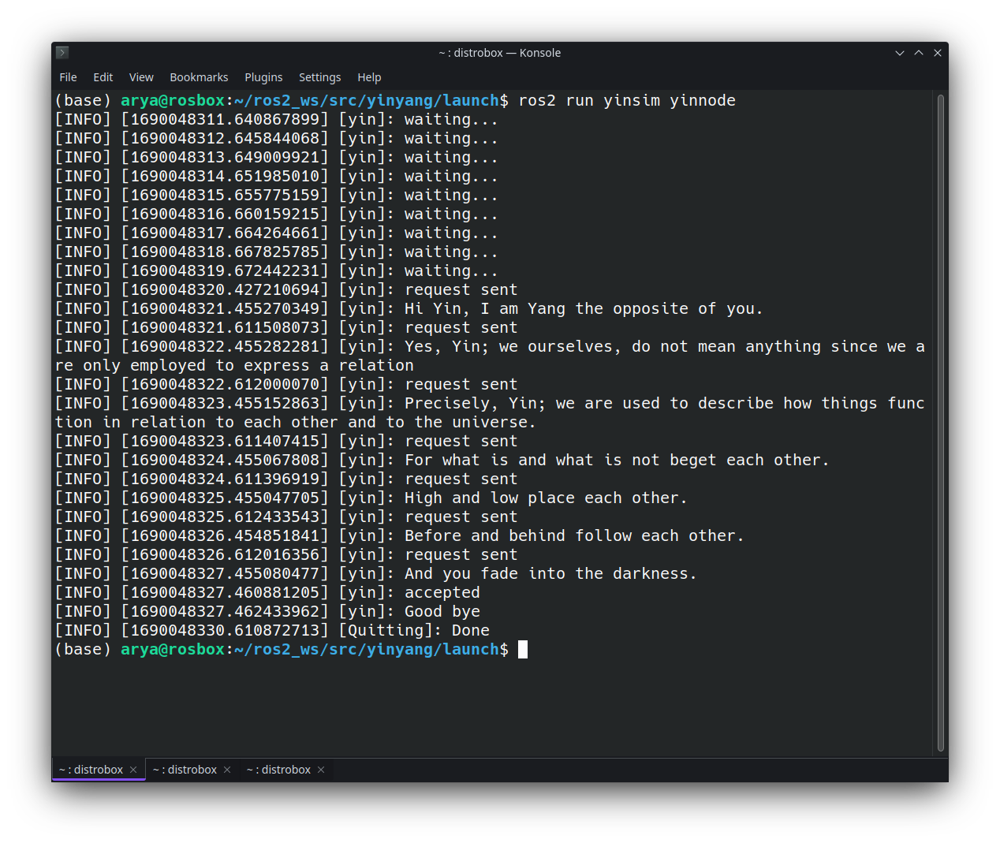
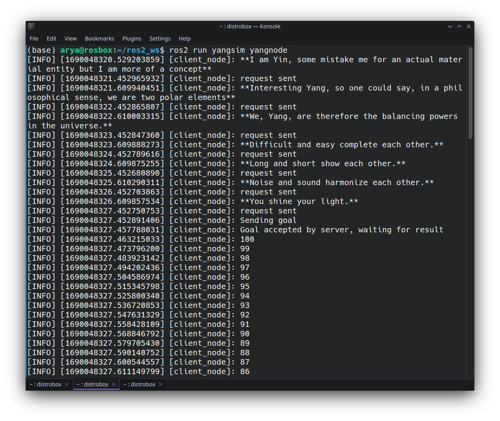
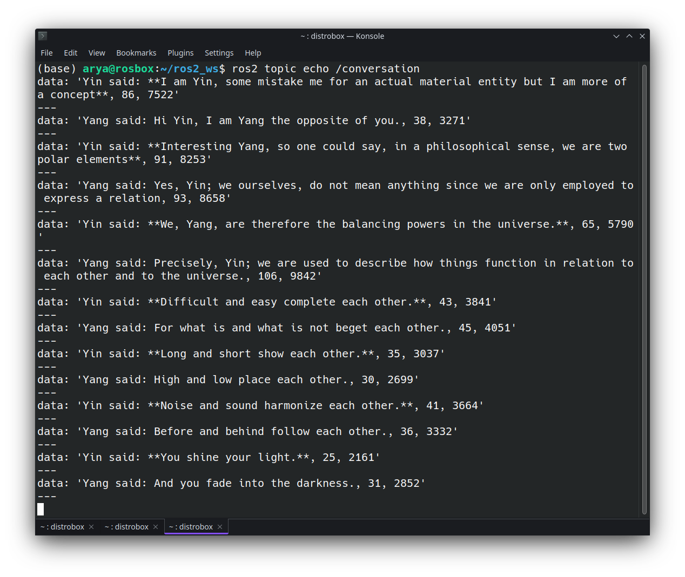

# Assignment2
----
## Exercise1

   
1. To add dependencies in a package, one must add them in the package.xml file, then rosdep will handle the installation. According to the ROS documentation, [`distribution.yaml`](https://github.com/ros/rosdistro/blob/master/humble/distribution.yaml) contains ROS packages like turtlesim (line 6970 of the humble/distribution.yaml). and base.yaml contains non-ROS system dependencies such as beep.

1. Since `slam_toolbox` is a ROS package, it can be found in distribution.yaml, where link of the package's Github repository is specified and rosdep can install dependency using that.
In contrast, `ffmpeg` is a non-ROS dependency, thus it is in base.yaml. As can be seen in base.yaml line 989, ffmpeg system packages for different Linux distributions are defined, and rosdep can install them using the names.

1. `IDL` is a term for a language that lets a program or object written in one language communicate with another program written in another language. IDLs describe an interface in a language-independent way, enabling communication between software components that do not share one language. Since ROS packages could be defined in C++ or Python, IDL is needed to make communication between nodes possible. Once the .msg files are defined, ROS provides tools for generating code in C++ and Python, and then nodes can use this generated code to send and receive messages over the ROS network.

----
## Exercise2
The code for this exercise can be found in the [`yinyang`](yinyang) directory.

