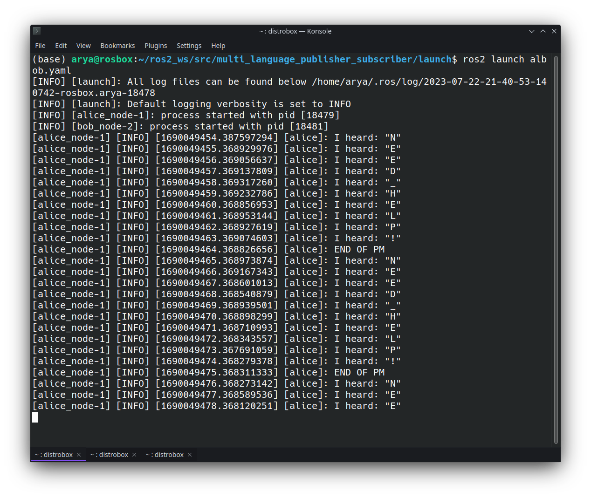
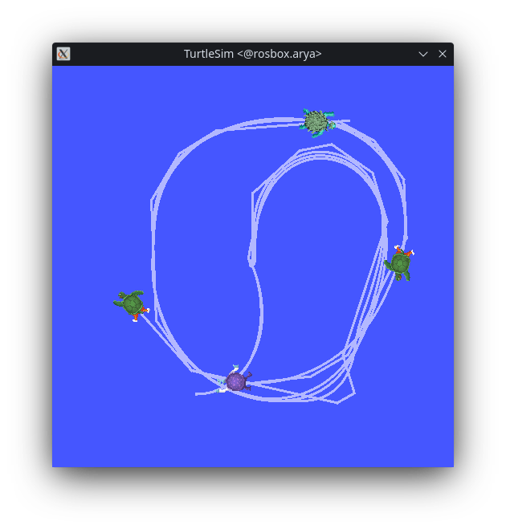

# Assignment3
----
## Exercise1

1. [YAML launcher](../assignment1/multi_language_publisher_subscriber/launch/albob.yaml) for Alicesim and Bobsim packages:
    
2. [YAML launcher](../assignment2/yinyang/launch/yinyang_launch.yaml) for Yinsim and Yangsim packages:
    

3. `Tf2` uses the idea of scene graphs, but scene graphs are designed to be iterated across, and in the case of `tf2`, using graphs will create transform loops. To prevent this problem, `tf2` uses a tree structure which is more efficient both in the case of search computations and preventing loops.
4. `static_transform_publisher` is the proper way to define static transformations that can be used either as a command line tool or a node that can be added to the launch files.
If the `static_transform_publisher` was not available, we had to use `StaticTransformBroadcaster` to publish the static transforms in the code.
5. Static transformations represent the fixed relationship between coordinate frames that do not change during the operation of the robot system. For example, if there is a fixed sensor and a manipulator, the transformation between the two frames is static because both frames are fixed and do not change over time.
On the other hand, Dynamic transformations can change over time as the robot moves. For example, the transformation between a manipulator's base frame and arm frame changes over time, so it is dynamic.
6. The `URDF` file describing the robot's kinematics and geometry is read by the Robot State Publisher package, which then creates the static transforms needed by the TF2 library to show the relationship between the system's different coordinate frames. “Robot State Publisher is supplied with a kinematic tree model (`URDF`) of the robot. It then subscribes to the joint_states topic (of type `sensor_msgs/msg/JointState`) to get individual joint states. These joint states are used to update the kinematic tree model, and the resulting 3D poses are then published to tf2.
----
## Exercise2
The code for this exercise can be found in the [`turtlemania`](turtlemania) package.

