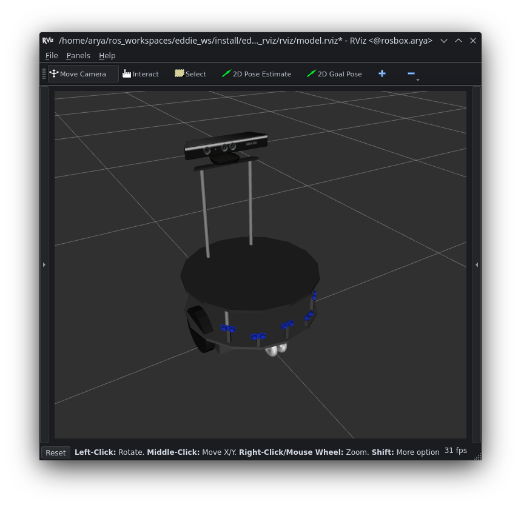
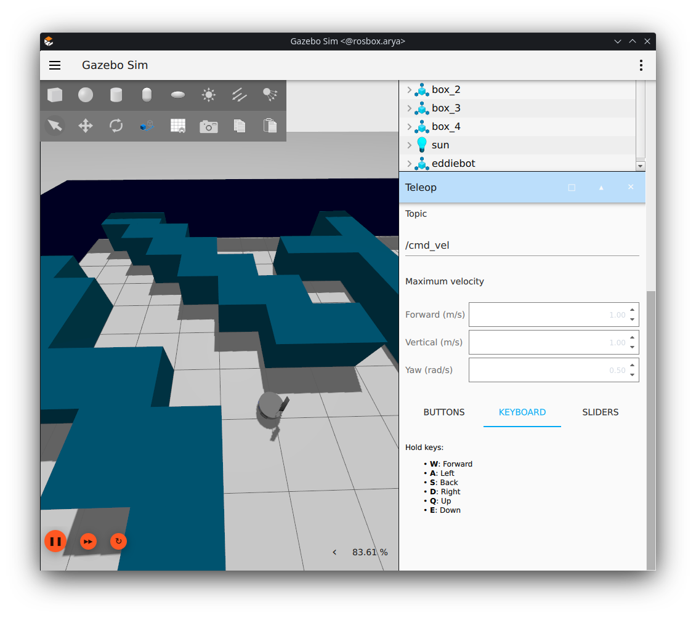

# Assignment5
----
to install gazebo, first install some necessary tools:

``` bash
sudo apt-get update
sudo apt-get install lsb-release wget gnupg
```
then install Gazebo-Garden:

``` bash
sudo wget https://packages.osrfoundation.org/gazebo.gpg -O /usr/share/keyrings/pkgs-osrf-archive-keyring.gpg
echo "deb [arch=$(dpkg --print-architecture) signed-by=/usr/share/keyrings/pkgs-osrf-archive-keyring.gpg] http://packages.osrfoundation.org/gazebo/ubuntu-stable $(lsb_release -cs) main" | sudo tee /etc/apt/sources.list.d/gazebo-stable.list > /dev/null
sudo apt-get update
sudo apt-get install gz-garden
```
After install gz-garden, add rosdep rules to resolve Gazebo Garden libraries:

``` bash
sudo bash -c 'wget https://raw.githubusercontent.com/osrf/osrf-rosdep/master/gz/00-gazebo.list -O /etc/ros/rosdep/sources.list.d/00-gazebo.list'
rosdep update
# check that resolve works
rosdep resolve gz-garden
```
And finally, clone(install from source) and install `ros_gz` package:

1. create workspace:
    ``` bash
    export GZ_VERSION=garden

    # Setup the workspace
    mkdir -p ~/ws/src
    cd ~/ws/src

    # Download needed software
    git clone https://github.com/gazebosim/ros_gz.git -b ros2
    ```
2. install dependencies:
    ``` bash
    cd ~/ws
    rosdep install -r --from-paths src -i -y --rosdistro humble
    ```
3. build the workspace:
   ``` bash
   # Source ROS distro's setup.bash
    source /opt/ros/<distro>/setup.bash

    # Build and install into workspace
    cd ~/ws
    colcon build
   ```

## Exercise1
First, install the dependencies: 
``` bash
rosdep install -r --from-paths src -i -y --rosdistro humble
```
Then, from eddiebot_rviz package, run the view_model launch file:
``` bash
ros2 launch eddiebot_rviz view_model.launch.py description:='True'
```
The result of running the following code:


## Exercise2

From eddiebot_gazebo, run the eddiebot_gz_sim launch file using the following code:

```bash
ros2 launch eddiebot_gazebo eddiebot_gz_sim.launch.py 'world:=maze_marked'
```
Then add a teleop option and set the correct topic for `cmd_vel`. The result:



## Exercise3

For this exercise, refer to the `rgb_navigate` package. This package utilizes a heuristic that determines the robot's angular velocity based on the RGB target it detects. The process involves considering a vertical line drawn from the middle of the Kinect image and counting the number of red, green, or yellow pixels on the left and right sides of that line. If one side has more colored pixels than the other, the robot should adjust its direction to steer towards the opposite side in order to maintain a straight trajectory towards the target.

Run:
```bash
ros2 launch rgb_navigate rgb_navigate.launch.py
```

When all the pixels in the image are colored, the robot will come to a halt and execute the command associated with the particular color.

