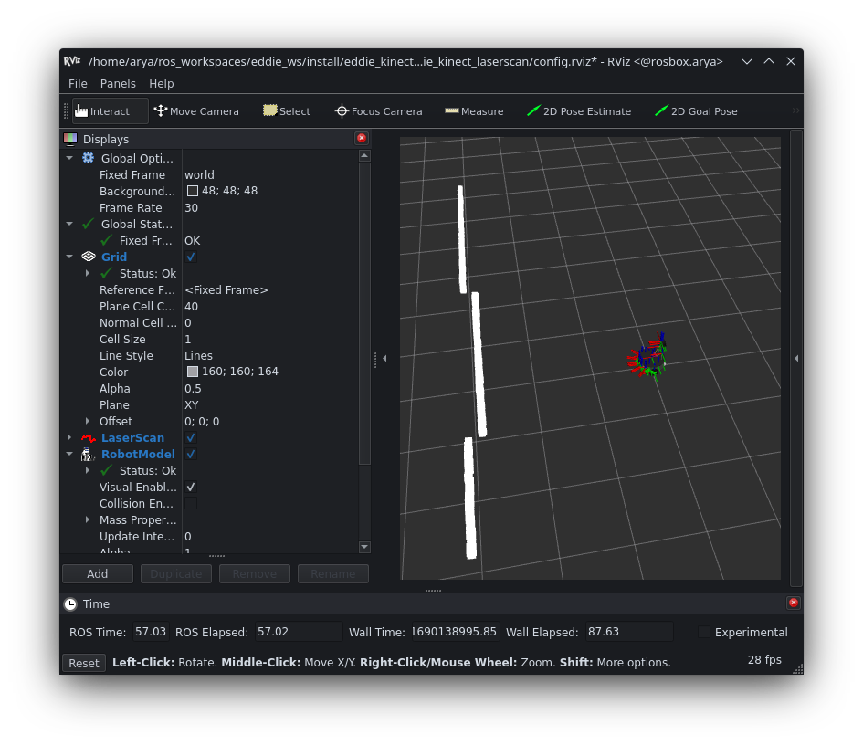
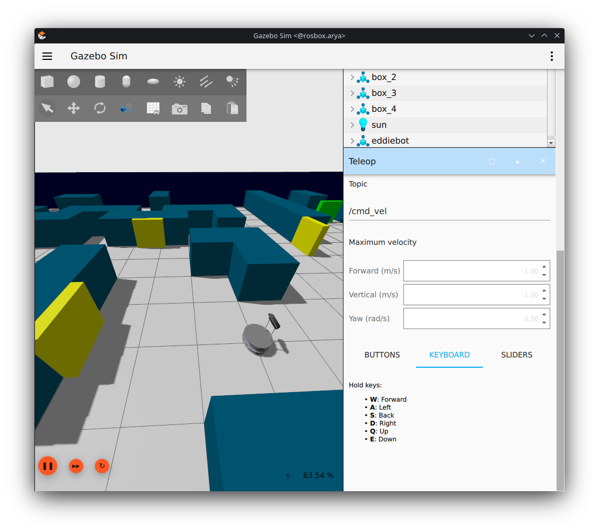
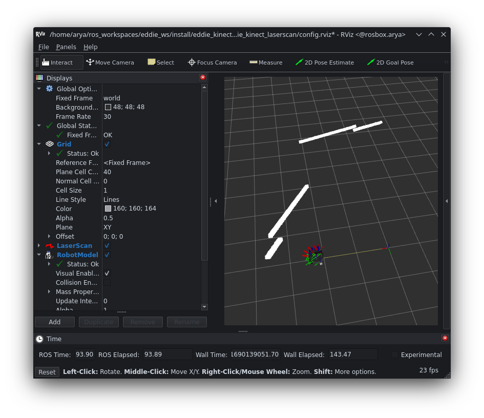
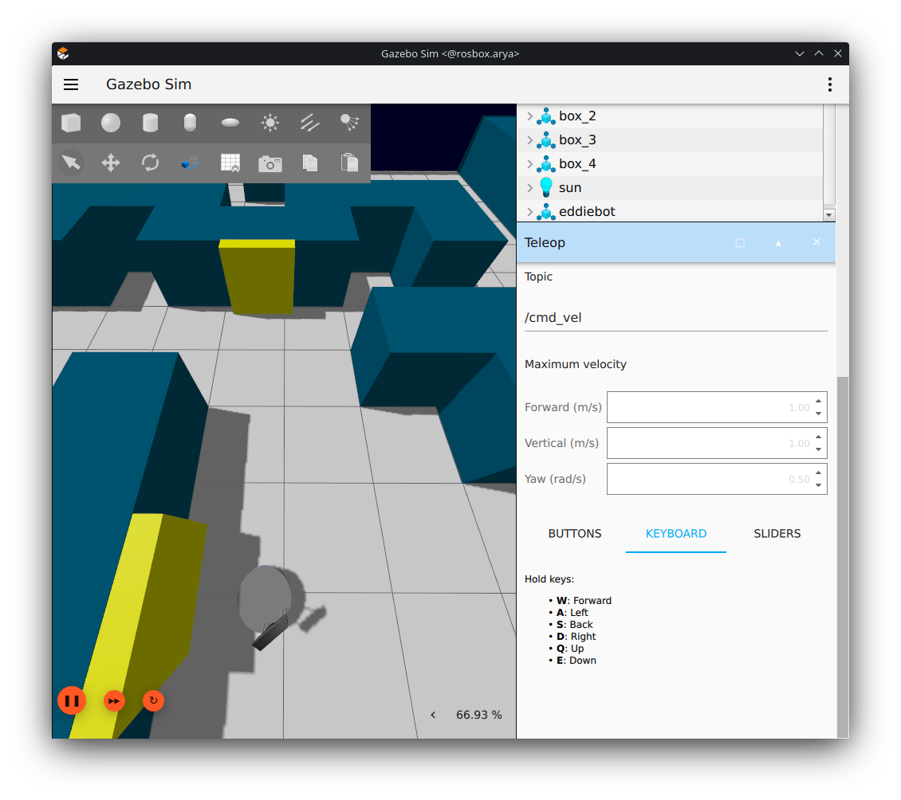
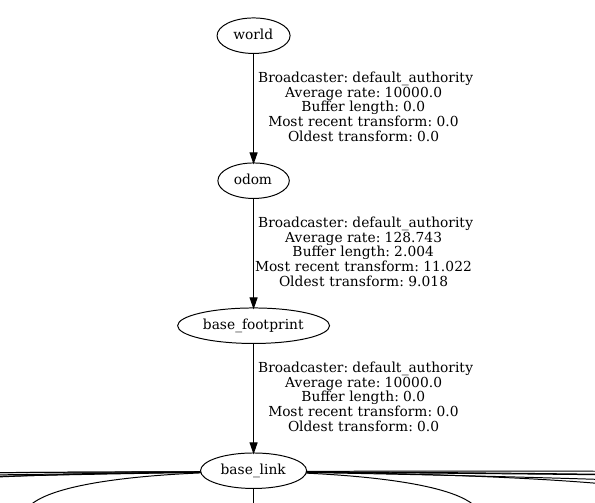

# Assignment6
----

## Exercise1
The [`VelocityControl`](https://gazebosim.org/api/sim/7/classgz_1_1sim_1_1systems_1_1VelocityControl.html) plugin exclusively subscribes to the cmd_vel topic and receives Twist messages. However, the [`DiffDrive`](https://gazebosim.org/api/sim/7/classgz_1_1sim_1_1systems_1_1DiffDrive.html) plugin is commonly used for mobile robot models with two driven wheels and potentially an unpowered wheel for stability. It subscribes to the `cmd_vel` topic and receives Twist messages. The plugin interprets these messages to calculate individual wheel velocities based on factors like wheelbase and wheel radius. It offers configuration options to customize parameters and also supports publishing odometry information.

## Exercise2

For this exercise, the [`eddie_kinect_laserscan`](eddie_kinect_laserscan) package has been created, comprising a launch file and an RViz configuration.

The launch file performs the following steps:

1. It uses the `eddiebot_gz_sim` launch file from the eddiebot_gazebo package to create a Gazebo simulation environment, with `use_sim_time` set to `true`.

2. A `bridge` node is created to convert Gazebo topics to `ROS2` topics, and necessary remaps are established.

3. The `depthimage_to_laserscan` node is launched, which subscribes to image topics and publishes the `scan` topic containing the laser scans.

4. Finally, an `RViz2` node is started using a saved config file along with the required static transforms. The RViz configuration file includes a `RobotModel` with its topic set to `robot_description`.

Regarding the scan topic and its data:

- The frame in the header of the scan topic is `camera_depth_frame`.

- The published data in the `scan` topic describes distances, which are set to `inf` if no obstacle is in range.

run:
```bash
ros2 launch eddie_kinect_laserscan eddie_kinect_laserscan.launch.py
```







## Exercise3
Before adding static transforms, there are two disconnected trees, which results in no transform between the `odom` and `base_footprint` frames. By adding static transforms between `world` and `odom`, and between `odom` and `base_footprint`, the tf system can calculate the transforms between these frames. This ensures that the entire tree becomes connected, allowing for proper transformation between all frames.


