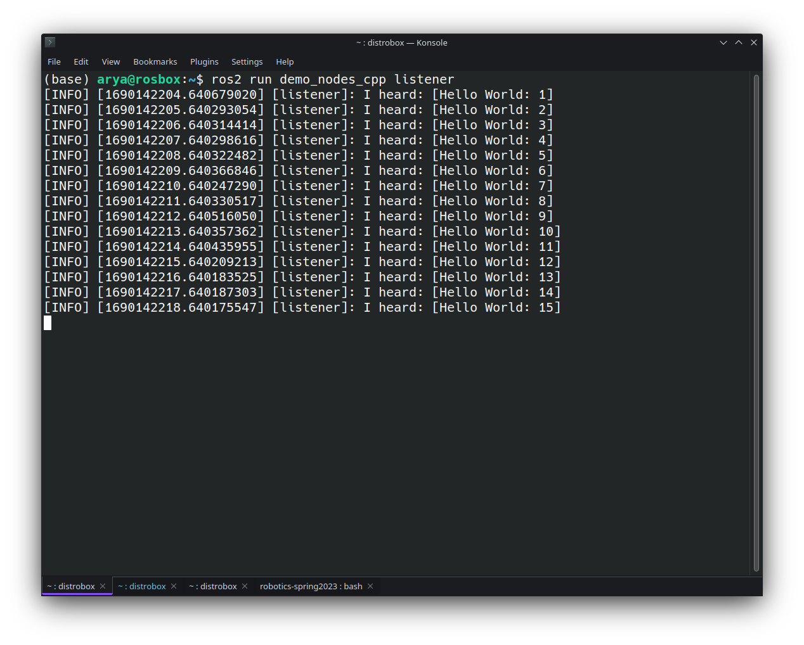
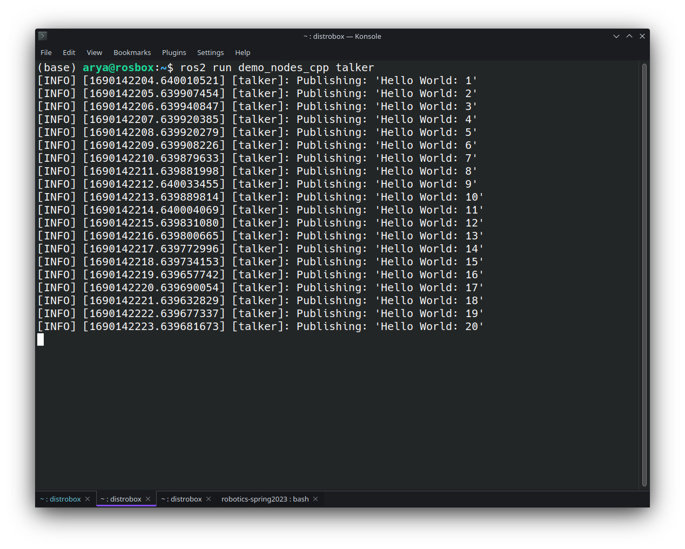
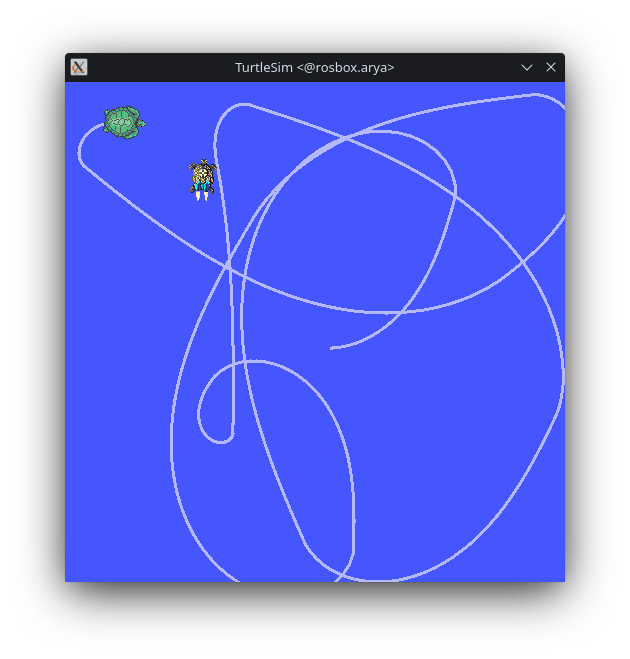
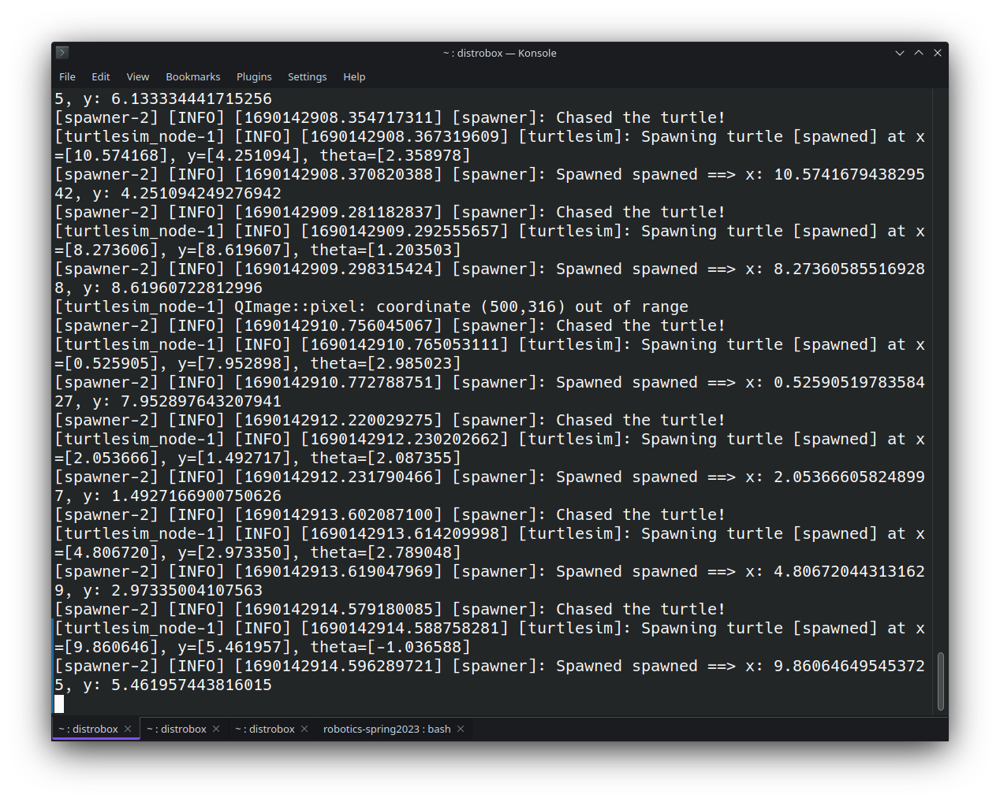

# Lab0
----

## Exercise1
Run following commands in seperate terminals:
```bash
ros2 run demo_nodes_cpp listener
```
```bash
ros2 run demo_nodes_cpp talker
```

The result is:



## Exercise2
As described in [Lab0](https://github.com/arashsm79/robotics-lab/blob/main/Labs/Lab_0.md), First, Clone the following package in `src` and build it with colcon.
```bash
cd ~/ros_ws/src
git clone https://github.com/kalashjain23/turtlechaser.git
```
Then install dependencies by running the following commands:

```bash 
cd ~/ros_ws
rosdep update
rosdep install -i --from-path src --rosdistro humble -y
```

And finally, build the package and launch it.

```bash
colcon build --packages-select turtlechaser
source ~/ros_ws/install/setup.bash
ros2 launch turtlechaser turtlechaser.launch.py
```




