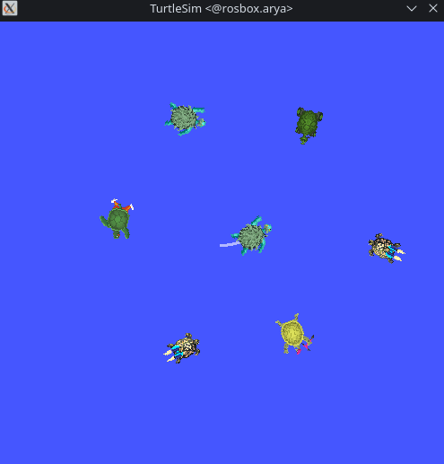
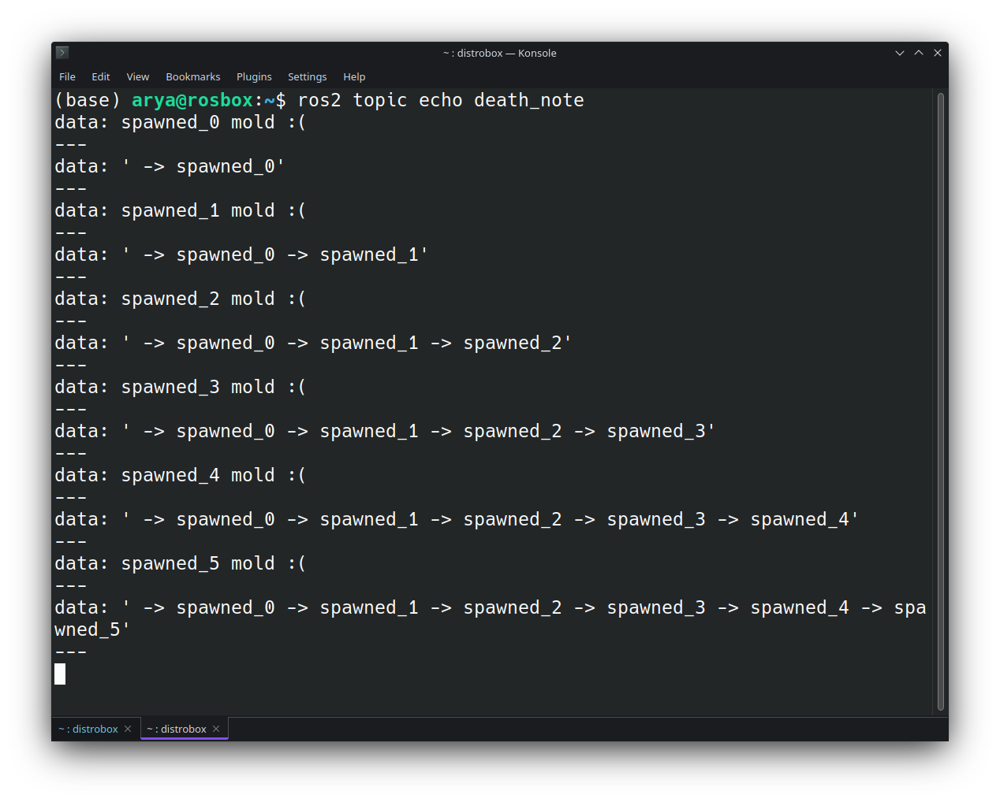

# Lab1
----

  

In this lab, we create a package comprising two nodes: a `spawner node` and a `controller node`. The spawner node is responsible for spawning six turtles on a polygon and subscribes to the chaser's pose topic to manage the killings. When the chaser gets close to any spawned turtle, it gets eliminated.

On the other hand, the controller node subscribes to the pose topics of the spawned turtles to access their positions one by one. Within the callback function for the chaser's pose topic, it calculates the distance between the chaser and the selected turtle (ith turtle). Subsequently, it generates an appropriate Twist command to chase and eliminate the targeted spawned turtle.

Moreover, in the event of any spawned turtle being killed, a string message will be published on a topic called `death_note` to inform which specific turtle was killed, along with another string indicating the sequence of the killings.

The turtle_chaser package is available [here](turtle_chaser).

