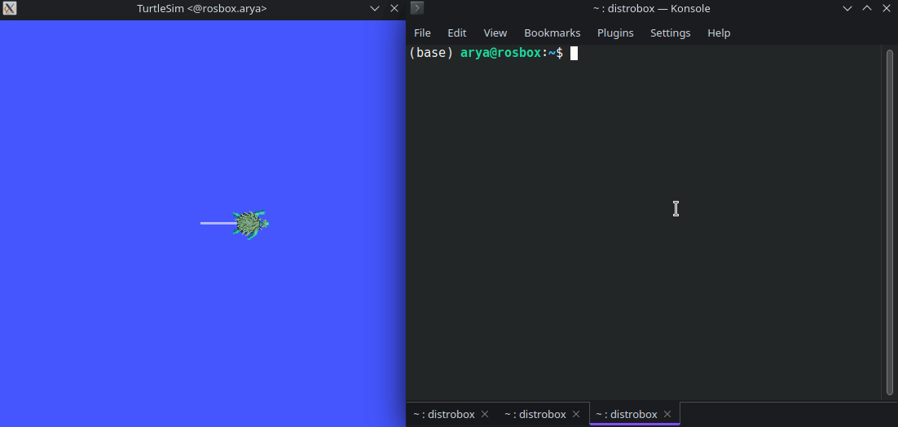

# Lab2
----
The exercise is available at [here](https://github.com/arashsm79/robotics-lab/blob/main/Labs/Lab_2.md).

  

In this lab, a package is developed to replicate the functionality of the Finite State Machine (FSM) illustrated in the exercise. When the stop parameter is set to False, the turtle should move, and when set to True, it will come to a halt. Whenever the turtle encounters a wall, it will modify its direction of movement, moving backward for a fixed duration, and then turn randomly before resuming its motion.

The turtle_controller package is available [here](turtlesim_controller).
