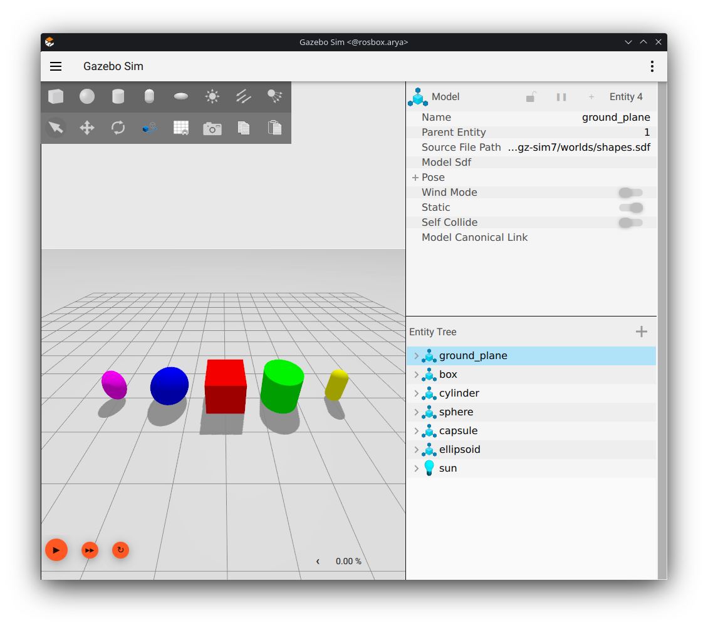
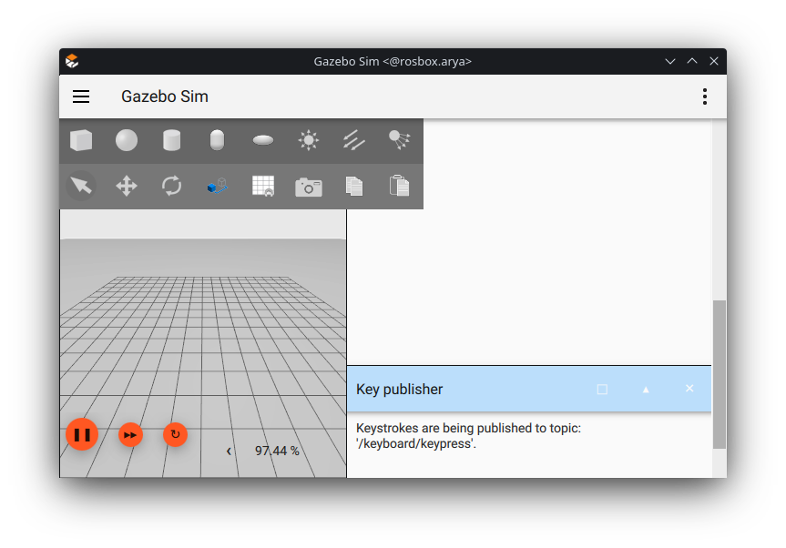
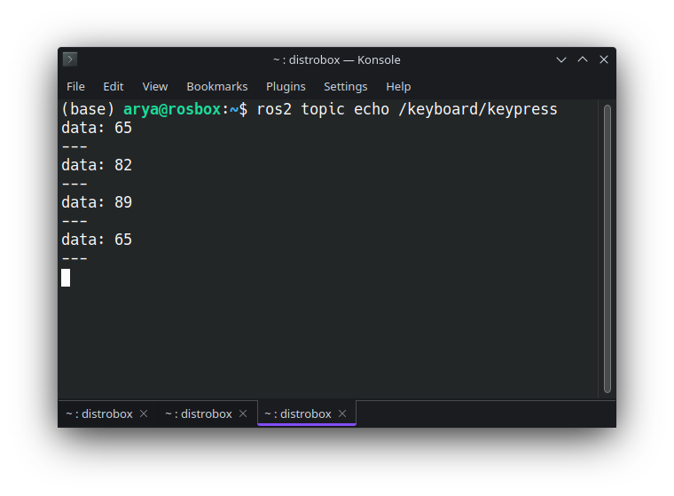

# Lab3
----
The exercise is available at [here](https://github.com/arashsm79/robotics-lab/blob/main/Labs/Lab_3.md).

A detailed step-by-step Gazebo installation tutorial is provided in [assignment5](../../assignments/assignment5)

## Exercise1

After sourcing the Gazebo workspace, execute the following command:

``` bash
gz sim shapes.sdf
```
The result should be like this:


## Exercise2

Gazebo and ROS2 publish distinct topics, but they can be interconverted using the [`ros_gz_bridge`](https://github.com/gazebosim/ros_gz/tree/ros2/ros_gz_bridge) library. In this exercise, we demonstrate the conversion of an Int32 message, which is published on /keyboard/keypress in Gazebo, to ROS2 format.

```bash
ros2 run ros_gz_bridge parameter_bridge /keyboard/keypress@std_msgs/msg/Int32@gz.msgs.Int32
```
We started a bridge on `/keyboard/keypress` topic with message of type `Int32`. For ROS it is `std_msgs/msg/Int32` and for Gazebo it is `gz.msgs.Int32`. The full list of topic conversions is available [here](https://github.com/gazebosim/ros_gz/tree/ros2/ros_gz_bridge).

In another terminal launch an Gazebo Sim world, for example the `empty.sdf` world:
```bash
gz sim empty.sdf
```
Then add the `Key Publisher` plugin from the dropdown menu on the top right corner, and start Gazebo simulation.



And finally:
```bash
ros2 topic echo /keyboard/keypress
```

Now by typing in Gazebo, ascii numbers are bridged into Ros2 topics and are shown in echo terminal.

