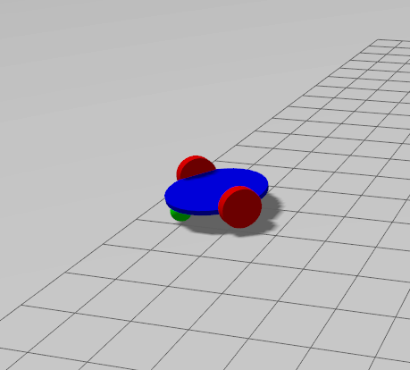

# Lab7
----
The package is available at [`simple_differential_drive`](simple_differntial_drive)

The question is available at [`arashsm79`](https://github.com/arashsm79/robotics-lab/blob/main/Labs/Lab_7.md) repo.

In this experiment, we are going to design a simple mobile robot and simulate it in Gazebo and then shake it using ROS2.

## Exercise1
In this exercise, a simple diff-drive with `sdf` format is implemented using the documents provided [here](https://gazebosim.org/docs/garden/building_robot).

  

## Exercise2
In this exercise, diff-drive plugin is added to the `sdf` file which recieves a `Twist` message from its `cmd_vel` topic.

## Exercise3
However, this topic is a Gazebo topic and have to be converted using `ros_gz_bridge` to Ros2 topics. a ros2 package is created which by using a timer, it makes the robot to move forward and backward in 2sec intervals, and also a launch file is created which creates a `ros_gz_bridge` node alongside the main package node.

  

