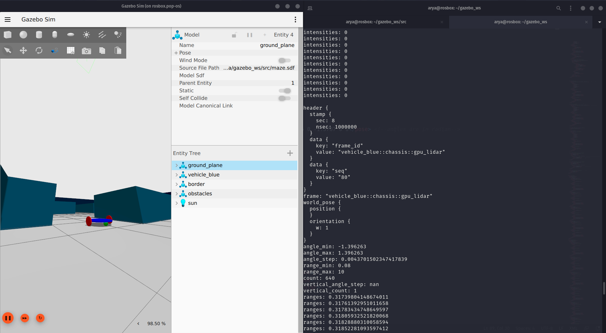
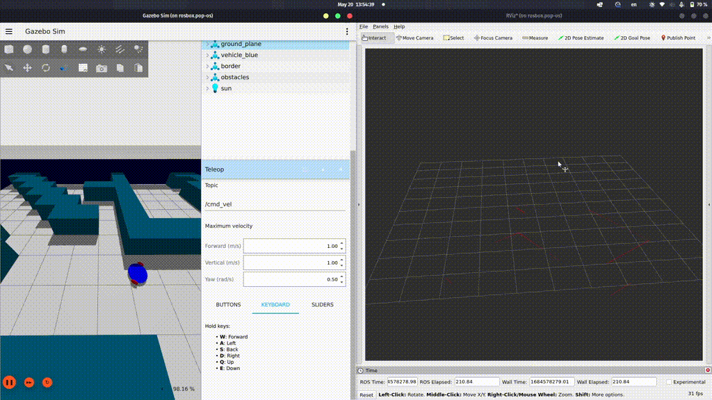

# Lab8
----
The package is available at [`maze`](maze)

The question is available at [`arashsm79`](https://github.com/arashsm79/robotics-lab/blob/main/Labs/Lab_8.md) repo.

In this lab, we are going to add a LIDAR sensor to the mobile robot designed in the previous experiment. This sensor finds the distance to objects and can be used, for example, to make a map of the environment.

## Exercise1
In this exercise, LIDAR sensor is added to the `sdf` file using [this tutorial](https://gazebosim.org/docs/garden/sensors#lidar-sensor). The topic output is shown bellow:

  

## Exercise2
In this exercise, the Gazebo topic of LIDAR is converted to ROS2 topic by using `ros_gz_bridge`. note that the static transform between `world` frame and `gpu_lidar` frame should be addded. Finally, the LIDAR output is illustrated in Rviz2:

  

## Exercise3
A ROS2 package is developed which does the static transforms and bridges. This package handles the robot's movements such that if it gets close to a obstacle, it stops and moves backward. After turning for a random amount, it starts moveing again and this process repeats.

  

