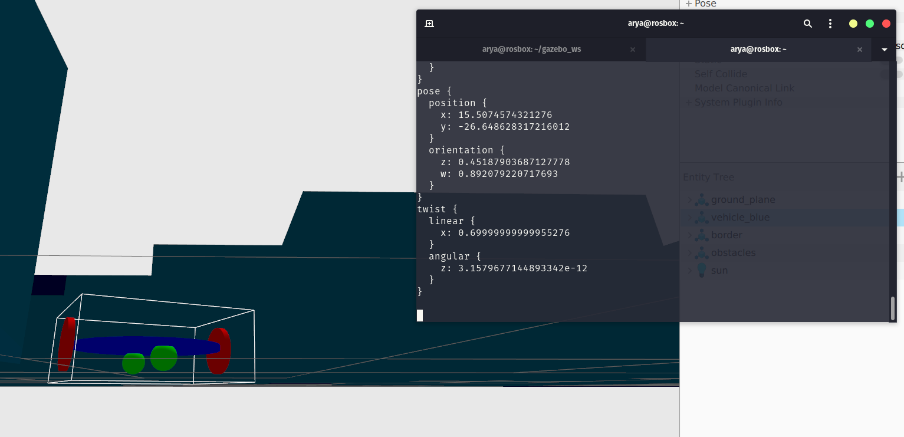
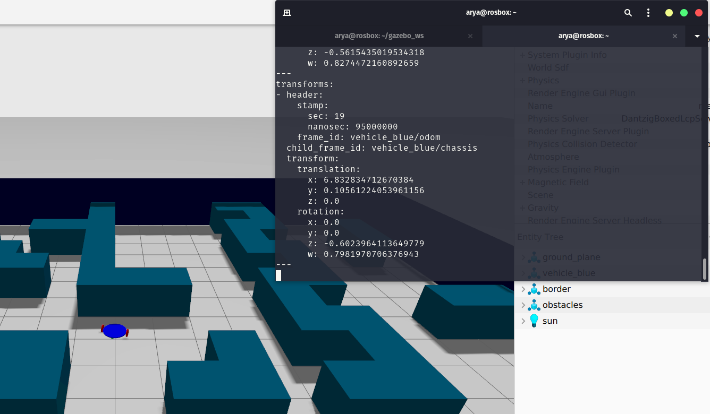
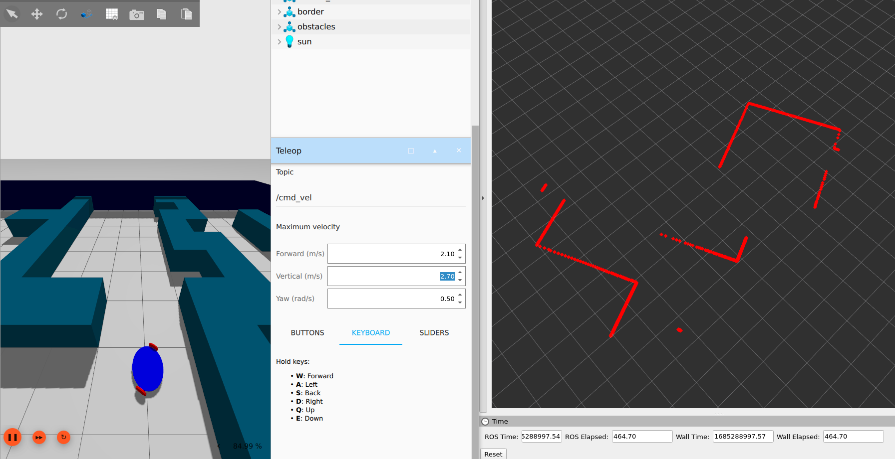

# Lab9
----
The package is available at [`maze2`](maze2)

The question is available at [`arashsm79`](https://github.com/arashsm79/robotics-lab/blob/main/Labs/Lab_9.md) repo.

## Exercise1
First, another castor wheel is added to balance robot, and the odometry and diff-drive plugins are also added. 
Odometry between odom and chassis frames is published on odom topic:

  

## Exercise2
In this exercise, the `tf`(with remapping) and `LIDAR` topics are converted to ROS2 topics using`ros_gz_bridge`. Two static transform nodes are also added in the launch file.

  

## Exercise3
The previous package LIDAR topics is illustrated in Rviz2:

  

